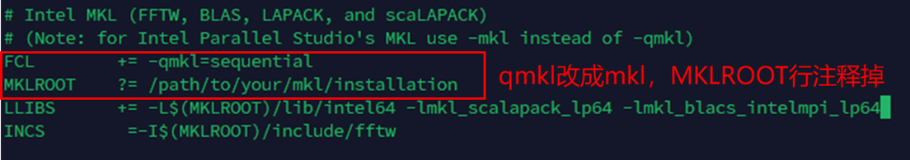
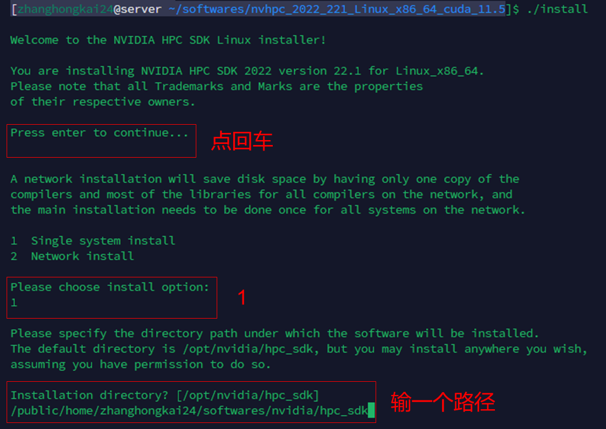
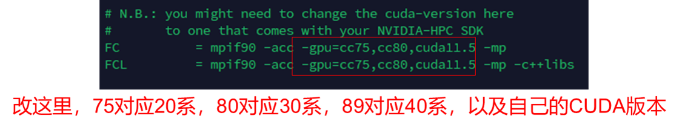
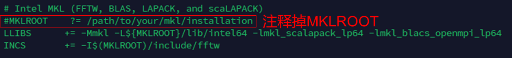

# 1. 源码获取
1. 从`NAS/组内文件/CODES/vasp.6.3.0.tgz`下载源码
2. 直接从`/public/software/vasp/`复制

# 2. 6.3.0版本编译
下好后解压就可以编译了
```bash
cd vasp.6.3.0
source /public/software/intel-2022/setvars.sh #intel oneapi环境设置  
cp arch/makefile.include.intel makefile.include #编译文件  
nano makefile.include #修改一些参数，详见下图  
make DEPS=1 -j8 all #输出std、gam、ncl文件，j8表示8核并行编译，all包括std、gam、ncl版本  
```

使用自己编译的版本只需要将`pbs`脚本中的`EXE=~/softwares/VASP/vasp.6.3.0/bin/vasp_gpu`指定自己的路径就行。  
6.3之前的版本好像只用改include不用设环境，忘记了。

# Additon. GPU版本
## 1. 安装`cuda`及`nvhpc`  
直接下[cuda-11.8](https://developer.nvidia.com/cuda-11-8-0-download-archive)的版本吧，能兼容20、30系卡的旧驱动，也有40系compute_89，可谓又新又好。  
非root用户安装`cuda`详见[教程](https://zhuanlan.zhihu.com/p/198161777)，后面的DNN那块应该是不用的。  
[nvhpc](https://developer.nvidia.com/hpc-sdk-releases)要下和`cuda`版本一致的，cuda11.8对应的最新版本是[22.11](https://developer.nvidia.com/nvidia-hpc-sdk-2211-downloads)。  
下载好解压安装
```bash
tar zxvf nvhpc_2022_2211_Linux_x86_64_cuda_11.8.tar.gz #根据自己下的版本改
cd nvhpc_2022_2211_Linux_x86_64_cuda_11.8
./install
```

然后挂着等装完

## 2. 配置环境变量
```bash
source /public/software/intel-2022/setvars.sh #intel oneapi环境设置  
#cuda的
export PATH=~/softwares/cuda-11.8/bin:$PATH
export LD_LIBRARY_PATH=~/softwares/cuda-11.8/lib64:$LD_LIBRARY_PATH #要改成实际安装路径
#nvhpc的
export PATH=~/softwares/nvidia/hpc_sdk/Linux_x86_64/22.11/compilers/bin:$PATH
export PATH=~/softwares/nvidia/hpc_sdk/Linux_x86_64/22.11/comm_libs/mpi/bin:$PATH
export LD_LIBRARY_PATH=~/softwares/nvidia/hpc_sdk/Linux_x86_64/22.11/compilers/extras/qd/lib:$LD_LIBRARY_PATH #要改成实际安装路径
```  
检查环境变量
```shell
$ which nvfortran
~/softwares/nvidia/hpc_sdk/Linux_x86_64/22.11/compilers/bin/nvfortran
$ which mpirun
~/softwares/nvidia/hpc_sdk/Linux_x86_64/22.11/comm_libs/mpi/bin/mpirun #这里mpi用的nvhpc里的
```
配置nvhpc的`gcc版本`，因为它默认安装用的是`/usr`里的远古版本，可以通过`makelocalrc -n`查看。
```bash
makelocalrc -o -gcc $(which gcc) -gpp $(which g++) -g77 $(which gfortran) >> ~/softwares/nvidia/hpc_sdk/Linux_x86_64/22.11/nvlocalrc #NFS系统-x用不了
export NVLOCALRC=~/softwares/nvidia/hpc_sdk/Linux_x86_64/22.11/nvlocalrc
```
## 3. 编译gpu版本  
回去之前的`vasp源码`文件夹
```bash
cd vasp.6.3.0  
cp arch/makefile.nvhpc_ompi_mkl_omp_acc makefile.include #编译文件
make veryclean #清除一下之前编译过的东西，每次重新编译都要执行一遍，不然报错
mv bin/vasp_std  bin/vasp_std_cpu
mv bin/vasp_gam  bin/vasp_gam_cpu
mv bin/vasp_ncl  bin/vasp_ncl_cpu #把前面编译过的保存一下，不然会覆盖
```
修改`makefile.include`文件  

比如改成，兼容20、30、40系卡
```txt
-gpu=cc75,cc86,cc90,cuda11.8
```

改好后和上面一样`make DEPS=1 -j8 all`应该就能编译了，输出一样是`vasp_std`,`vasp_gam`,`vasp_ncl`，可以加gpu后缀区分
## 4. 运行gpu版本  
主要是要用nvhpc里的mpirun
```bash
#!/bin/bash
#PBS -N gpu
#PBS -l nodes=node013:ppn=1
#PBS -j oe
#PBS -q zf
#gpu版只用1核
export NVLOCALRC=~/softwares/nvidia/hpc_sdk/Linux_x86_64/22.11/nvlocalrc
export PATH=~/softwares/nvidia/hpc_sdk/Linux_x86_64/22.1/compilersbin:$PATH
export PATH=~/softwares/nvidia/hpc_sdk/Linux_x86_64/22.1/comm_libs/mpi/bin:$PATH
export LD_LIBRARY_PATH=~/softwares/nvidia/hpc_sdk/Linux_x86_64/22.1compilers/  extras/qd/lib:$LD_LIBRARY_PATH #加上前面的nvhpc环境变量
export CUDA_VISIBLE_DEVICES=0 #指定用哪张卡
EXE=~/softwares/VASP/vasp.6.3.0/bin/vasp_gpu #指定vasp可执行文件的路径
OUT=LOG.vasp
NPROCS=$(wc -l < "$PBS_NODEFILE")
cd "$PBS_O_WORKDIR"
mpirun -machinefile $PBS_NODEFILE -np $NPROCS $EXE >> $OUT 2>&1 
#这里的mpirun来自nvhpc，而不是/public/software/intel那
/public/bin/info_job.sh
```

